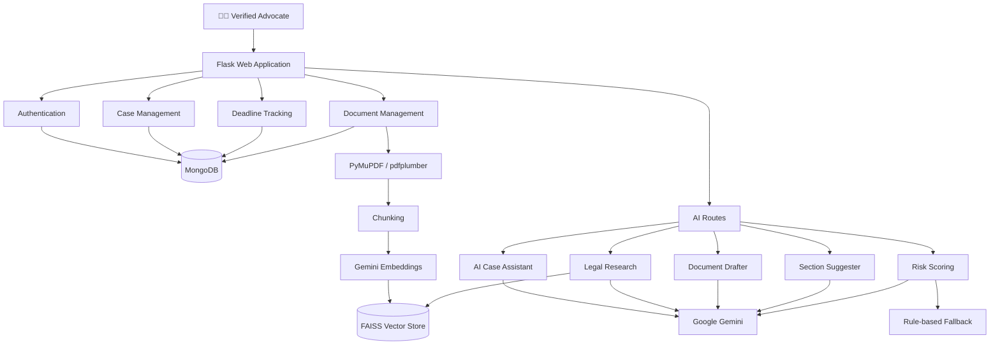

<div align="center">

# ⚖️ LegalMind AI

### AI-Powered Legal Workflow Copilot for Indian Advocates

**Verify → Manage → Analyze → Research → Draft → Suggest → Prioritize**

<p>
  
  
  
  
  
</p>

<p>
  A secure, lawyer-only platform that connects advocate verification, case management, deadlines, document intelligence, AI assistance, legal research, drafting, section suggestion and risk prioritization.
</p>

</div>

---

## 🚀 Overview

LegalMind AI is an **AI-assisted legal workflow platform for verified advocates**. Instead of treating legal AI as only a chatbot, the system connects the major stages of a case workflow through a common case-centric architecture.

The supplied project specification defines ten integrated features across authentication, case management and AI-powered legal assistance. fileciteturn2file0L10-L20

### Core workflow

```text
Advocate Verification
        ↓
Lawyer Login
        ↓
Case Command Center
   ↙        ↓        ↘
Deadlines  Documents  Case Context
               ↓
            FAISS
        ↙       ↓       ↘
   AI Assistant  Research  Drafting
        
Section Suggester ← standalone incident workflow
        ↓
Risk Scoring ← deadlines + documents + case signals
```

---

## ✨ Complete Feature Set

| ID | Feature | Purpose | Main implementation |
|---|---|---|---|
| **F1** | 🪪 Advocate Verification | Validates enrollment format, checks simulated registry, prevents duplicate enrollment | `advocate_registry.py` + JSON registry |
| **F2** | 🔐 Lawyer-Only Login | Protects pages with authenticated Flask sessions | Flask sessions + `login_required` |
| **F3** | 📂 Case Command Center | Centralized case CRUD, status, deadlines and risk visibility | Flask + MongoDB |
| **F4** | ⏰ Deadline Tracker | Tracks and visually prioritizes deadlines | Deadline routes + MongoDB |
| **F5** | 📄 PDF Upload & Analysis | Extracts, chunks and indexes legal documents | PyMuPDF + pdfplumber + FAISS |
| **F6** | 🤖 AI Case Assistant | Case-aware conversational legal assistance | Gemini + case context + chat history |
| **F7** | 🔎 Legal Research (RAG) | Retrieves relevant legal chunks before Gemini synthesis | Gemini embeddings + FAISS |
| **F8** | 📝 Document Drafter | Generates five common legal document types | Gemini + `python-docx` |
| **F9** | ⚖️ Section Suggester | Converts an incident description into structured legal-section suggestions | Gemini + JSON validation |
| **F10** | 📊 Risk Scoring Engine | Produces a 0–100 case-priority score | Gemini + rule-based fallback |

The specification describes the same ten features and explicitly defines the five drafter templates and the Section Suggester outputs. fileciteturn2file1L36-L42

---

## 🧠 What makes the project different?

The differentiator is **workflow integration**.

```text
Identity
   ↓
Case
   ↓
Deadlines ─────┐
               ↓
Documents → Retrieval → AI
               ↓          ↓
             Research   Assistant
                          ↓
                        Drafting

Incident → Section Suggester

Case + Deadlines + Documents → Risk Score
```

The project specification links the case dashboard, PDF/FAISS layer, AI chat, research, drafting and risk scoring around the case workflow. fileciteturn2file1L44-L58

The accompanying research work also emphasizes the importance of connecting AI predictions with evidence and human-understandable explanations instead of relying on fluent model output alone. fileciteturn2file7L512-L527

---

## 🏗️ System Architecture



### Application composition

The repository's `app.py` creates the Flask application, loads environment variables, creates runtime directories, registers the auth/case/AI/document/deadline blueprints and initializes the database. citeturn5file0

### Persistence architecture

The current repository implementation uses **MongoDB**. The database module creates indexes for users, cases, deadlines, documents, chat history and section suggestions. citeturn7file0

---

## 📁 Repository Structure

```text
LegalMind_AI/
│
├── app.py
├── config.py
├── requirements.txt
├── .gitignore
├── README.md
│
├── data/
│   └── advocate_registry.json
│
├── models/
│   ├── __init__.py
│   └── database.py
│
├── routes/
│   ├── __init__.py
│   ├── auth.py
│   ├── cases.py
│   ├── ai_routes.py
│   ├── documents.py
│   └── deadlines.py
│
├── services/
│   ├── __init__.py
│   ├── advocate_registry.py
│   ├── gemini_service.py
│   ├── pdf_service.py
│   ├── rag_service.py
│   ├── doc_generator.py
│   ├── section_suggester.py
│   └── risk_scorer.py
│
├── static/
│   └── css/
│       └── style.css
│
├── templates/
│   ├── base.html
│   ├── login.html
│   ├── register.html
│   ├── dashboard.html
│   ├── research.html
│   ├── section_suggester.html
│   └── ...
│
├── uploads/
├── generated/
└── vector_store/
    └── faiss_index/
```

The GitHub repository tree confirms the route/service/template separation and the runtime folders used by the application. citeturn3file0

---

# 🔐 1. Advocate Verification & Authentication

### F1 — Advocate Verification

Registration is designed as a verification gate:

```text
Full Name + Enrollment No + State
            ↓
       Format Check
            ↓
      Registry Match
            ↓
    Duplicate Check
            ↓
     Verified Account
```

The project specification describes enrollment numbers such as `MH/1234/2020` and three levels of validation before an account is created. fileciteturn2file0L13-L15

The implementation exposes `/auth/verify-enrollment` as an AJAX verification endpoint and then performs the final validation again during account creation. Passwords are stored using Werkzeug password hashing. citeturn8file0

### F2 — Lawyer-only access

Protected handlers use a `login_required` decorator that checks whether `lawyer_id` exists in the Flask session. Login stores the lawyer ID, name, enrollment number, state, bar council and role in the session. citeturn8file0

---

# 📂 2. Case Command Center

The Case Command Center is the platform's central workspace.

Typical information surfaced by the case workflow includes:

```text
Case Title
Client
Case Type
Court
Status
Next Deadline
Risk Score
Documents
AI Conversation
```

The specification describes case cards with client name, case type, status, next-deadline countdown and risk score, together with create/view/update/archive operations. fileciteturn2file0L17-L20

---

# ⏰ 3. Deadline Tracker

Deadlines are designed to be immediately understandable:

```text
🔴 Overdue
🟠 Due within 3 days
🟢 Safe
```

The project specification describes a calendar-oriented deadline workflow with a seven-day alert view and case-linked deadlines. fileciteturn2file0L18-L20

MongoDB indexes deadlines by `case_id` and `due_date`, supporting efficient case-linked and date-oriented access. citeturn7file0

---

# 📄 4. PDF Upload & Document Intelligence

Legal documents can be converted into machine-searchable text.

```text
Upload PDF
   ↓
PyMuPDF extraction
   ↓
Fallback to pdfplumber
   ↓
Text chunks
   ↓
Gemini embeddings
   ↓
FAISS vector index
   ↓
Semantic retrieval
```

The PDF service tries PyMuPDF first and switches to pdfplumber when very little text is extracted. It also exposes metadata extraction and overlapping chunking utilities. citeturn11file0

### Current configuration

| Setting | Value |
|---|---:|
| Chunk size | `1000` characters |
| Chunk overlap | `200` characters |
| RAG top-k | `4` |
| Maximum request upload | `16 MB` |

These values are defined in `config.py`. citeturn6file0

---

# 🔎 5. Legal Research — Retrieval-Augmented Generation

Legal research follows a retrieval-first architecture:

```text
Legal Question
      ↓
Query Embedding
      ↓
FAISS Similarity Search
      ↓
Top-k Legal Chunks
      ↓
Gemini Synthesis
      ↓
Structured Research Answer
```

The repository builds a persistent FAISS index from PDFs stored in `data/`, stores chunk metadata in a pickle file, and can add individual case-document chunks to the existing index. citeturn10file0

The research prompt asks Gemini to organize the response into **Relevant Sections**, **Legal Position**, **Key Precedents** and **Strategic Insight**. citeturn12file0

### Vector store files

```text
vector_store/faiss_index/legal_index.faiss
vector_store/faiss_index/legal_chunks.pkl
```

---

# 🤖 6. AI Case Assistant

The case assistant is context-aware rather than a generic chatbot.

For each request the route builds case context using fields including:

```text
Case Title
Client Name
Case Type
Court
Status
Description
Risk Score
```

It also retrieves the latest ten chat messages, sends the conversation to Gemini and persists both user and assistant messages in MongoDB. citeturn9file0

The project specification describes this feature as case-grounded AI assistance using the full case context rather than generic legal responses. fileciteturn2file1L36-L37

---

# 📝 7. AI Document Drafter

Five templates are currently supported:

| Template | Intended output |
|---|---|
| **Legal Notice** | Formal legal notice |
| **FIR Draft** | First Information Report draft |
| **Affidavit** | Court affidavit |
| **Bail Application** | Bail application draft |
| **Contract Agreement** | Formal agreement |

The generator inserts case information, advocate identity and date into template-specific Gemini prompts, then converts the generated content into a DOCX with formatting, headings and a review footer. citeturn15file0

The project specification defines the same five templates and presents drafting as a case-connected workflow. fileciteturn2file1L38-L39

---

# ⚖️ 8. Section Suggester

One of the project's most distinctive AI workflows is incident-to-section analysis.

### Input

```text
Natural-language incident description
```

### Output

```json
{
  "primary_sections": [],
  "supporting_sections": [],
  "bailable": true,
  "cognizable": true,
  "court": "...",
  "fir_type": "...",
  "next_steps": [],
  "summary": "..."
}
```

The implementation asks Gemini for JSON, strips Markdown code fences, extracts the JSON object, parses it and validates required fields before storing the result. citeturn13file0

The specification describes support for Indian-law categories such as IPC, CrPC, IT Act, POCSO, NDPS and IBC where applicable. fileciteturn2file1L39-L39

> **⚠️ Responsible-use note:** Suggested sections and legal classifications are AI-generated assistance. They require professional verification against the facts and current law before use.

---

# 📊 9. Risk Scoring Engine

LegalMind AI uses two complementary scoring paths.

### AI scoring

Gemini receives case information plus operational signals:

```text
Case title
Case type
Court
Status
Description
Document count
Pending deadlines
Overdue deadlines
Days to next deadline
```

It returns a score, risk level, contributing factors, recommendation and a breakdown. citeturn14file0

### Rule-based fallback

If Gemini is unavailable or does not return a valid score, a deterministic fallback estimates risk from deadlines, documents and pending work. citeturn14file0

| Score | Level |
|---:|---|
| 0–25 | Low |
| 26–50 | Medium |
| 51–75 | High |
| 76–100 | Critical |

This hybrid design makes the feature less dependent on one AI response path. citeturn14file0

---

# 🛠️ Tech Stack

| Layer | Technology | Why it is used |
|---|---|---|
| UI | HTML / Bootstrap / JavaScript | Fast browser-based interface |
| Backend | Flask | Lightweight Python web application |
| Database | MongoDB | Persistent user/case/workflow data |
| LLM | Google Gemini 1.5 Flash | Chat, research synthesis, drafting and analysis |
| Embeddings | Gemini `embedding-001` | Vector representations for retrieval |
| Vector DB | FAISS | Local semantic search index |
| PDF processing | PyMuPDF + pdfplumber | PDF extraction and fallback parsing |
| Document generation | `python-docx` | DOCX output |
| Security | Werkzeug | Password hashing |
| Configuration | `python-dotenv` | Environment-based configuration |

The original project specification listed Flask, Gemini, LangChain, FAISS, PDF processing and database-backed storage as the target technology stack. The **current repository differs in an important detail: it uses MongoDB and the checked-in services implement the orchestration directly rather than depending on LangChain.** fileciteturn2file1L60-L95 citeturn7file0turn10file0

---

# ⚙️ Installation & Setup

## 1. Clone

```bash
git clone https://github.com/avaleajay170/LegalMind_AI.git
cd LegalMind_AI
```

## 2. Create virtual environment

### Windows

```bash
python -m venv venv
venv\Scripts\activate
```

### Linux / macOS

```bash
python3 -m venv venv
source venv/bin/activate
```

## 3. Install dependencies

```bash
pip install -r requirements.txt
```

The current `requirements.txt` includes Flask, PyMongo, PyMuPDF, pdfplumber, python-docx, dotenv and related runtime dependencies. citeturn4file0

## 4. Configure environment variables

Create a `.env` file:

```env
SECRET_KEY=replace-with-a-strong-secret
FLASK_DEBUG=True

GEMINI_API_KEY=your-gemini-api-key
GEMINI_MODEL=gemini-1.5-flash

MONGO_URI=mongodb+srv://<username>:<password>@<cluster>/<database>
MONGO_DB_NAME=legalmind_db

UPLOAD_FOLDER=uploads
GENERATED_FOLDER=generated
```

The variable names and default values come from `config.py`. citeturn6file0

## 5. Make sure MongoDB is reachable

The database module connects to `MONGO_URI`, tests the connection with a ping, selects the configured database and initializes the indexes. citeturn7file0

## 6. Run

```bash
python app.py
```

Then open:

```text
http://localhost:5000
```

The application listens on `0.0.0.0:5000` by default. citeturn5file0

---

# 📚 Build the Legal RAG Knowledge Base

Put source legal PDFs inside:

```text
data/
```

The RAG service can then create the index by:

```text
PDFs
 ↓
Text extraction
 ↓
1000-char chunks / 200-char overlap
 ↓
Gemini embeddings
 ↓
FAISS IndexFlatL2
 ↓
Persisted vector index + chunk metadata
```

The implementation stores source filenames with each chunk, allowing retrieved context to retain its originating document. citeturn10file0

---

# 🧩 Route Map

| Blueprint | Endpoint | Purpose |
|---|---|---|
| `auth` | `/auth/login` | Login |
| `auth` | `/auth/register` | Advocate registration |
| `auth` | `/auth/verify-enrollment` | Enrollment verification API |
| `auth` | `/auth/logout` | Logout |
| `auth` | `/auth/profile` | Advocate profile |
| `ai` | `/ai/chat` | Case AI assistant |
| `ai` | `/ai/research` | RAG legal research |
| `ai` | `/ai/draft` | Document drafting |
| `ai` | `/ai/suggest-sections` | Section suggestion |
| `ai` | `/ai/risk-score/<case_id>` | Calculate case risk |
| `ai` | `/ai/chat-history/<case_id>` | Retrieve chat history |
| `ai` | `/ai/clear-chat/<case_id>` | Clear case chat |
| `cases` | `/cases/...` | Case CRUD/dashboard |
| `documents` | `/documents/...` | Document workflows |
| `deadlines` | `/deadlines/...` | Deadline workflows |

The AI route module explicitly implements chat, research, drafting, section suggestion, risk scoring and chat-history operations. citeturn9file0

---

# 🔄 End-to-End User Journey

```text
┌────────────────────────────┐
│ 1. Advocate Registration   │
│    + Bar Council Check     │
└─────────────┬──────────────┘
              ↓
┌────────────────────────────┐
│ 2. Secure Login            │
└─────────────┬──────────────┘
              ↓
┌────────────────────────────┐
│ 3. Create / Manage Case    │
└─────────────┬──────────────┘
              ↓
      ┌───────┴────────┐
      ↓                ↓
┌───────────┐    ┌───────────────┐
│ Deadlines │    │ Upload PDFs   │
└─────┬─────┘    └──────┬────────┘
      │                 ↓
      │            ┌───────────┐
      │            │   FAISS   │
      │            └─────┬─────┘
      │                  ↓
      │       ┌──────────┼──────────┐
      │       ↓          ↓          ↓
      │     Chat      Research    Drafting
      │
      └──────────────┐
                     ↓
                Risk Score

Incident Description
        ↓
Section Suggester
```

---

# 🔒 Security & Data Handling

The repository has several useful baseline controls:

- Passwords are hashed with Werkzeug rather than stored directly. citeturn8file0
- Authenticated routes use a session-based `login_required` check. citeturn8file0
- MongoDB creates unique indexes for email and enrollment number. citeturn7file0
- Runtime uploads are stored separately from application code.
- Gemini credentials are intended to come from environment variables. citeturn6file0

For production, additional controls such as encryption at rest, strong secret management, audit logging, fine-grained authorization, secure file scanning and current-law validation should be added.

---

# ⚠️ Limitations & Responsible Use

LegalMind AI should be treated as an **AI-assisted prototype / academic project**, not an autonomous legal decision-maker.

Important review points include:

```text
AI section suggestions
        ↓
Professional verification required

AI-generated drafts
        ↓
Lawyer review required

Risk scores
        ↓
Use as prioritization aid, not a legal conclusion

Retrieved legal content
        ↓
Verify source + currency before relying on it
```

The accompanying research work identifies the same broader concern: fluent explanations do not automatically prove that the explanation is faithful to the evidence responsible for a model decision. It recommends evaluating faithfulness, consistency and human interpretability alongside predictive performance. fileciteturn2file7L439-L468

---

# 🔮 Future Roadmap

```text
✅ Integrated advocate + case workflow
        ↓
✅ AI chat + RAG + drafting
        ↓
✅ Section suggestion + risk scoring
        ↓
⬜ Current-law / statute versioning
        ↓
⬜ Judgment / citation verification
        ↓
⬜ OCR for scanned case PDFs
        ↓
⬜ Source citations in AI responses
        ↓
⬜ Audit logs and encryption
        ↓
⬜ Automated RAG / hallucination evaluation
        ↓
⬜ Production-grade deployment
```

The accompanying research also highlights the need for systematic evaluation, explanation faithfulness and robustness as AI systems move from prototypes toward trustworthy deployments. fileciteturn2file6L384-L429

---

# 🧪 Demo Checklist

Use this sequence to demonstrate the project:

```text
[ ] Register advocate
[ ] Verify enrollment
[ ] Login
[ ] Create a case
[ ] Add a deadline
[ ] Upload a legal PDF
[ ] Run legal research
[ ] Ask the case assistant a question
[ ] Generate a document
[ ] Test Section Suggester
[ ] Refresh the risk score
[ ] Show chat history
```

---

# 💻 Development Notes

### Flask app

The application follows a blueprint-based organization rather than placing all endpoints inside one file. This makes the project easier to extend as additional legal workflows are introduced. citeturn5file0turn3file0

### AI service separation

`gemini_service.py` keeps the main Gemini interaction and task-specific prompts centralized, while dedicated services handle RAG, document generation, section suggestion and risk analysis. citeturn12file0turn10file0turn15file0turn13file0turn14file0

### Resilience

Risk analysis includes a non-LLM fallback path, which means a temporary AI failure does not necessarily eliminate the application's ability to produce a usable priority estimate. citeturn14file0

---

# 📖 Research Context

The accompanying research paper frames a related AI direction around **multilingual, evidence-grounded and explainable NLP**. It identifies gaps in combining multilingual modelling, prediction evidence and human-readable explanation, and proposes a pipeline that links preprocessing, Transformer models, XAI and explanation generation. fileciteturn2file3L132-L150 fileciteturn2file7L499-L527

That research perspective complements LegalMind AI's broader design philosophy: **AI should support human decision-making with context, evidence and review rather than replace professional judgment.**

---

# 🌟 Project Summary

> **LegalMind AI is more than a legal chatbot.**
>
> It is a connected legal workflow platform that brings advocate verification, case management, deadlines, document analysis, retrieval-augmented research, AI assistance, document drafting, incident-to-section suggestions and case-risk prioritization into one application.

The supplied project specification explicitly positions these connected capabilities as an end-to-end legal copilot. fileciteturn2file0L10-L20

---

<div align="center">

## ⚖️ LegalMind AI

### **Smarter legal workflows. Better context. Human-reviewed decisions.**

[View Repository](https://github.com/avaleajay170/LegalMind_AI)

</div>
